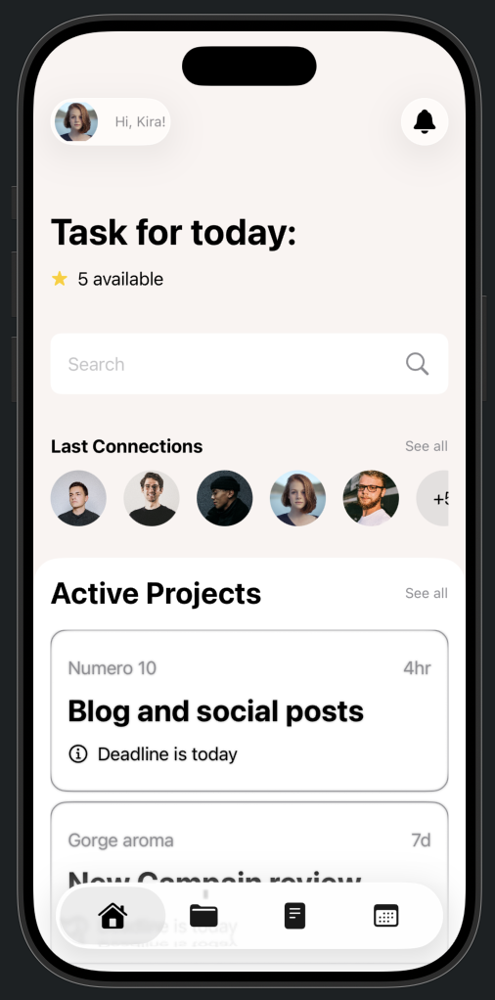

# 📱 Project Management App

A simple **UI/UX practice project** built using **SwiftUI**.  
This app demonstrates clean layout design, tab navigation, reusable components, and card-based UI presentation — inspired by modern project management dashboards.

---

## 🚀 Features

- **Home Screen**
  - Displays today’s tasks with a search bar and “last connections” list.
  - Shows active projects in a modern card layout.
  - Custom toolbar with profile image and notification icon.

- **Tab View Navigation**
  - Includes multiple tabs (Home, Folder, Document, Calendar).
  - Uses `TabView` for smooth tab switching with system icons.

- **Card-Based UI**
  - Each project card shows user name, post time, title, and info.
  - Clean bordered design using `RoundedRectangle` overlays.

- **Reusability**
  - Reusable components:
    - `CardView` → for displaying project details.
    - `SearchbarView` → simple and modern search bar.
    - `CircularImage` (custom image view).

---

## 🧠 Technologies Used

- **SwiftUI**
- **Xcode 16**
- **Reusable Views** (CardView, SearchbarView)
- **Dynamic data rendering** using `ForEach` and `ScrollView`

---

## 📸 Screenshot

Here’s the preview of the Home Screen UI:

  
   
  <em>Home Screen Preview</em>

---

## 💡 Purpose

This project is made for **UI/UX design practice** in SwiftUI — focusing on layout, components, and clean design patterns.
